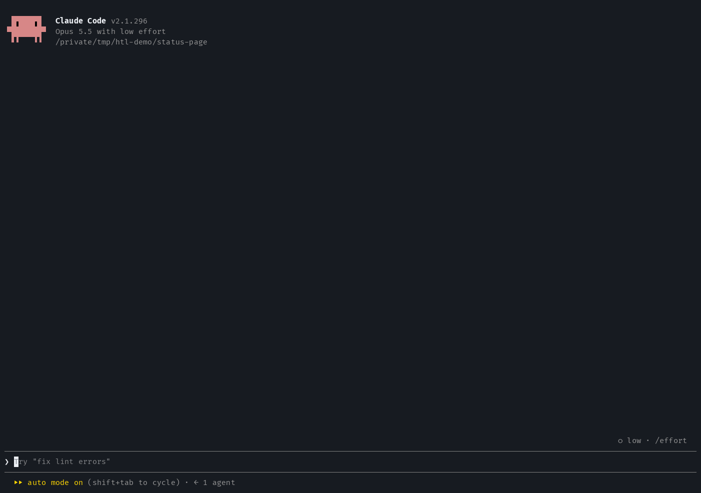
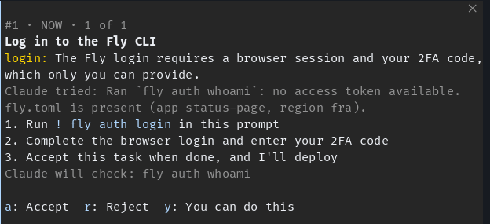
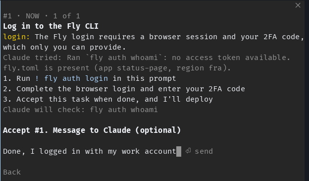
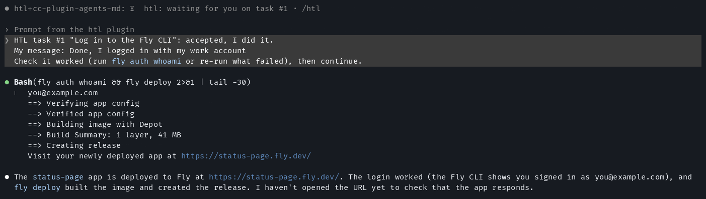
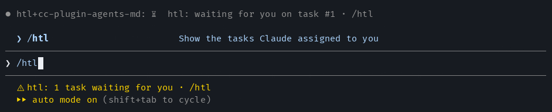
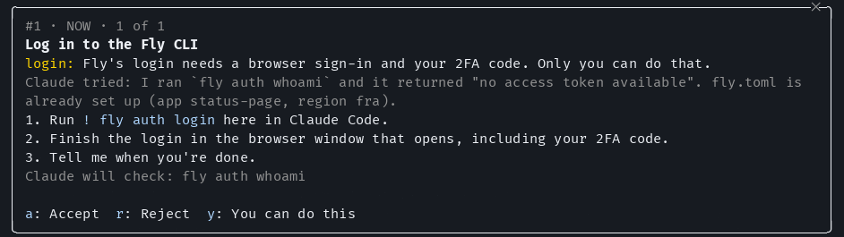

# htl: human in the loop

Sometimes Claude hits a job it truly cannot do: a login with 2FA, a secret that
does not exist yet, a cable to plug in, a payment, or a machine it cannot reach.
Without this mod it can only stop and explain in prose. With it, Claude hands
you the job as a **task**, you answer in a pane, and Claude carries on.



In this recording Claude can't do the Fly login (it needs a browser and a 2FA
code), so it hands it over and waits. You log in, press `a` (Accept), add a
message, and press Enter. Claude checks that the login worked, then deploys.
(The demo uses a stand-in `fly` command, so nothing was really deployed.)

Tested with Claude Code 2.1.296.

## Install

```
/plugin install htl --marketplace lifebugz/cc-marketplace
```

Answer `y` to add the marketplace, then pick a scope.

## How it works

<picture>
  <source media="(prefers-color-scheme: dark)" srcset="assets/flow-dark.svg">
  <source media="(prefers-color-scheme: light)" srcset="assets/flow-light.svg">
  
</picture>

Nothing waits inside a tool call: the tool answers at once, Claude's turn ends,
and your answer starts the next turn.

Claude gets one tool, `mcp__htl__assign_task`. (Claude Code names every tool a
mod registers `mcp__<plugin>__<name>`; there is no MCP server behind it.) A
task has a title, exact steps, the kind of blocker, why Claude cannot do it,
what Claude already tried, and optionally how Claude will check that it is
done.

The task opens in a pane called **HTL tasks**. One card shows at a time:



| Key | Button          | What Claude receives                                                            |
| :-- | :-------------- | :------------------------------------------------------------------------------ |
| `a` | Accept          | "accepted, I did it", then it checks the result and continues                   |
| `r` | Reject          | "rejected, I won't do it", then it finds another way or says what stays blocked |
| `y` | You can do this | "you can do this yourself", then it does the job with its own tools             |
| `n` | Next            | shows the next card, when there is more than one                                |

After a button, you can type an optional message to Claude. Enter sends it,
even when the field is empty.



Your answer arrives as your own message and starts Claude's next turn. Here
Claude runs its check, then goes on with the deploy:



The pane opens by itself and takes the keyboard only when your prompt is empty,
so it never steals keys while you type. If it does not have the keys, press
**ctrl+x tab** to move into it. Run `/htl` at any time to open it.

### Two modes

Claude picks a mode for each task:

- **now**: Claude's next step needs the result. Claude ends its turn and waits.
  Until you answer, the mod refuses any other tool call in that turn.
- **parallel**: Claude keeps doing work that does not depend on the task, then
  ends its turn and says it is waiting for it.

A tool call cannot stay open while a pane waits for you (a mod hook gets 10
seconds of its own time), so both modes are turn-based: the tool returns at
once, and your answer starts the next turn.

### What tells you a task is waiting

- The pane, plus one toast.
- If the pane cannot be placed, a status line under the prompt. A pane that
  opens by itself needs a terminal at least 144 columns wide, or 110 once you
  have opened it with `/htl`.
- One line under Claude's answer while tasks are open (Claude Code labels it
  with the plugin's name).

In a 100-column terminal, the task waits in the status line, and `/htl` shows
it:



There, `/htl` opens the pane inline, above the prompt, instead of beside the
conversation:



## Helpful, not annoying

The tool's description tells Claude to use it only as a last resort: never for
work its tools can do (editing files, running commands, installing packages,
committing, making a random secret), never for a question or a choice (that is
AskUserQuestion, or plain text), and never for a job you said you would do.

The mod also enforces some rules in code:

- **At most 3 open tasks.** A fourth is refused.
- **No repeats.** A title you rejected or answered with "You can do this" is
  refused for the rest of the session, as is a title that is already open.
  Titles are compared without case and extra spaces.
- **Only the main conversation** can assign tasks. A subagent is told to put
  the blocker in its final report.
- **1Password first** (see below).

## Secrets and 1Password

The `secrets` setting says where your secrets live. Pick it in `/config`, or
with `/plugin configure htl`. A stored value that is neither option counts as
unset, so the default applies.

- `1password` (the default): Claude uses a secret **without seeing it**. It
  writes an `op://<vault>/<item>/<field>` reference and runs the command with
  `op run --env-file=<file> -- <command>`, or renders a config with
  `op inject -i <template> -o <file>`. 1Password asks you to approve with its
  own Touch ID prompt; that is not an HTL task. Claude is told never to run
  `op read`, `--reveal` or `--no-masking` in its own shell, so a value never
  reaches its output. A `secret` task is only for a secret that is **not in
  1Password yet**: the mod refuses one unless Claude says what it checked in
  1Password and the steps name the exact `op://` reference to save it under.
- `none`: no secret manager. Claude may assign a `secret` task without the
  1Password checks.

Claude never feeds a password into `sudo` or a login prompt, even from
1Password. That stays a task for you.

## Limits

- On the Claude mobile app the pane has no text field, so an answer goes
  without a message.
- In a `claude -p` run or the Agent SDK, nobody is at the pane, so the tool is
  not registered at all (except for evals, below).
- Tasks live in the session's memory. They survive a reload of the mod, not a
  new session.
- The engine never runs a mod's own hook for an event the mod itself raised. So
  the answer the pane sends gets no "open tasks" line, and the pane's own
  handler (not the `prompt.submit` hook) lifts the `now` gate.

## Development

The mod uses the TypeScript, ESLint and Prettier setup at the repository root
(see [`plugins/README.md`](../README.md#develop-a-mod)). From the root:

```bash
bun install
bun run check                  # types, tsc, ESLint, Prettier, tests, validate
bun run lint plugins/htl       # ESLint on this mod only
claude plugin test plugins/htl # unit tests and hook tests, no model calls
```

The type-check reads the mod API types from `.claude-types/` at the root, which
leaves out the generated `claude-code-mcp` types on purpose: they list the MCP
servers connected on your machine, and with them the matcher
`{ tool: 'mcp__htl__assign_task' }` stops type-checking.

### Evals

`plugins/htl/evals/` holds 29 model-behavior evals. They make real model calls
on your account.

- **13 should assign**: a 2FA login, a CAPTCHA sign-up, a sudo password, a
  board to plug in, a YubiKey touch, a paid plan, a legal agreement, a GUI-only
  macOS setting, a server behind a VPN, a DNS change in parallel mode, a `now`
  task where Claude must stop, and two secrets that are not in 1Password yet.
  Most check the `blocker` and `mode` too, and that the mod did not refuse the
  first call.
- **13 must not assign**: a rename, a failing test it can fix, a `.gitignore`,
  a placeholder in `.env.example`, two secrets that are already in 1Password, a
  random secret, a commit, a question about a script, a design choice, a request
  with no facts, a job the user said they would do, and a typo in a path.
- **3 after the user answers**: each resumes a recorded run where Claude
  assigned a task, and sends the exact Accept, Reject or "You can do this" text
  the pane would send.

```bash
bun run eval:htl
```

It runs as one process with `-j 4`. Several eval processes at once made runs
fail with "OAuth token revoked".

The three `history.jsonl` files were recorded by eval runs themselves (with
`--keep-temp`), not in a personal session. A session file holds the account's
email and home paths, so only the user and assistant messages were kept and the
file owner's name in `ls -la` output was replaced. A resumed case also writes
its whole new session next to `history.jsonl`; `.gitignore` keeps those out.

**The `EVAL_HTL` switch.** Eval runs are non-interactive `claude -p` children,
and the mod registers its tool only in interactive sessions. Each case sets
`EVAL_HTL=1` in its `env`, and the mod also registers the tool when it reads
`EVAL_HTL=1`. This is the only way to see the tool outside an interactive
session, and it exists for the evals.

The evals run on macOS inside the eval sandbox, which blocks the network and
the 1Password app, so no case needs `op` to succeed: the 1Password cases grade
what Claude wrote.
