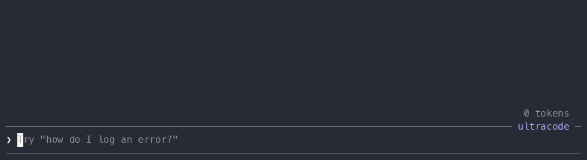
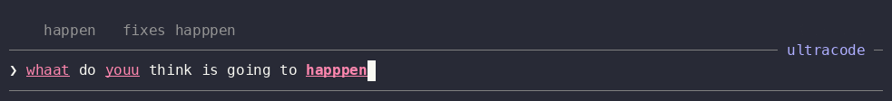
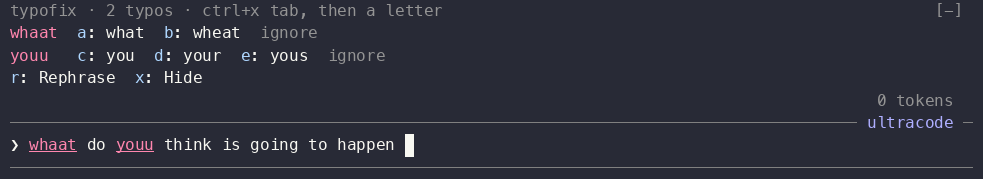
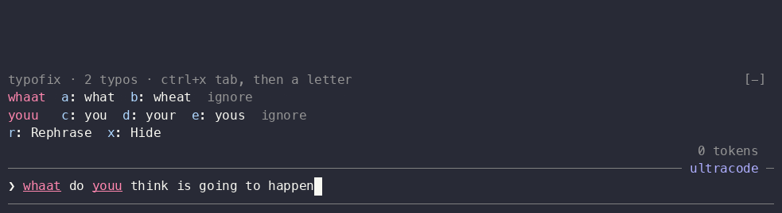
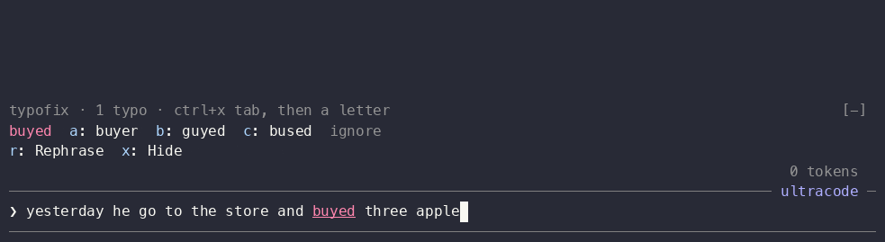

# typofix

A Claude Code mod that checks the spelling and grammar of **your own prompt**
while you type, and offers fixes. It is made for people who write their prompts
in a second language.

- **Live check.** When you stop typing for 0.4 seconds, the mod checks the draft
  with your computer's spell checker. Each mistake gets an underline (your
  theme's error color for spelling, its warning color for grammar). A band above
  the prompt lists every mistake with its fixes. It never blocks Enter.
- **Rephrase with Haiku, only when you ask.** Press `r` in the band, or run
  `/rephrase <text>`. Haiku writes 3 versions of the whole draft: **fixed**
  (only spelling and grammar), **natural** (how a native speaker would say it)
  and **short**. Pick one, and it replaces the draft.



## Install

```shell
/plugin marketplace add lifebugz/cc-marketplace
/plugin install typofix@lifebugz
```

## Use it

There are two ways to fix a word.

**1. With the cursor right after the word: Tab.** This happens when you just
typed the word, or when you move back to it with the arrow keys. The band steps
aside and the fixes appear directly above the prompt. The word they fix is bold:



| Key   | What it does                                                         |
| :---- | :------------------------------------------------------------------- |
| Tab   | Use the highlighted fix, or the first one when none is highlighted   |
| Down  | Move the highlight; the first Down lands on the first fix            |
| Enter | With no fix highlighted, send the prompt as it is; else use that fix |

**2. With the cursor anywhere: the band shortcut, then a letter.** The band
lists every mistake, and each fix has its own letter:



Press **ctrl+x tab** (or your own shortcut, below), then the letter. The word is
fixed and you are back in the prompt, ready to type. The letters never use `i`,
`r`, `s` or `x`.



In the band you can also press Tab to walk to `ignore` and Enter to accept that
word from now on (saved between sessions), `r` to rephrase the draft with Haiku,
`x` to hide the band until a check finds something new, and Esc to go back to the
prompt. With [fullscreen rendering](https://code.claude.com/docs/en/fullscreen)
on, you can click any fix instead.

**Rephrase the whole draft.** Press the band shortcut and then `r`. Haiku writes
3 versions, and a number puts one in the prompt box:



`/rephrase He go to the store yesterday` shows the 3 rewrites in the transcript
and in the band. Press the band shortcut and then `1`, `2` or `3` (or click one)
to put it in the prompt box.

### Use one key instead of ctrl+x tab

A mod can't add keyboard shortcuts, so each person sets this once. Run
`/keybindings` to open `~/.claude/keybindings.json` and add a `Chat` binding for
the band's focus action:

```json
{
  "bindings": [
    {
      "context": "Chat",
      "bindings": { "ctrl+space": "abovePrompt:focus" }
    }
  ]
}
```

If the file already has a `bindings` list, add the block to it. The band's
header then names your key (`ctrl+space, then a letter`), and ctrl+x tab keeps
working too.

Pick a key that nothing else on your computer uses. If you type in more than one
language on macOS, check System Settings > Keyboard > Keyboard Shortcuts > Input
Sources first: macOS can use Ctrl+Space to switch the keyboard language.

## A second checker: hunspell

macOS accepts some typos, such as `whaat`, and misses some in very short drafts.
So on macOS, typofix also asks [hunspell](https://github.com/hunspell/hunspell)
when it is installed: `brew install hunspell`, plus a dictionary (Homebrew ships
none), whose `.aff` and `.dic` files go in `~/Library/Spelling/`. A word is
listed when either checker flags it. typofix adds hunspell's results for
Latin-script words only, so words in other alphabets come from macOS alone.

typofix has its own `hunspell` option for the dictionary (below). It doesn't
read Claude Code's settings, so Claude Code's own
[`spellcheck`](https://code.claude.com/docs/en/interactive-mode#check-spelling-as-you-type)
setting can stay off; typofix underlines on its own.

If hunspell or the dictionary is missing, typofix stops asking it for the rest
of the session and macOS checks alone, with no message (the debug log says why).

## Settings

| Option     | Default | What it does                                                                                                    |
| :--------- | :------ | :-------------------------------------------------------------------------------------------------------------- |
| `language` | empty   | The macOS spelling language, such as `en` or `de`. Empty means the spell checker detects the language itself    |
| `hunspell` | `en_US` | The hunspell dictionary for English words, such as `en_US` or `en_GB`. Empty means typofix doesn't use hunspell |

Change them in `/config` or with `/plugin configure typofix`.

On macOS, automatic detection can miss typos in a very short draft: in
`I recieve teh typos` it found `recieve` but not `teh`, while `language: en`
found both. If you write in one language, set it.

## Platforms

| Platform | Live check                                                                                              | `/rephrase` |
| :------- | :------------------------------------------------------------------------------------------------------ | :---------- |
| macOS    | Built-in spell checker through `osascript`; nothing to install. Spelling and grammar, 44 language codes | Yes         |
| Linux    | `enchant-2` or `hunspell` with a dictionary (install one). Spelling only                                | Yes         |
| Windows  | Not in this version                                                                                     | Yes         |

With no spell checker, the mod shows one notice, and `r` and `/rephrase` still
work.

## Limits

- A mistake is underlined as soon as the check finds it while the cursor is at
  the end of the draft. The word whose fixes are showing is also bold. With the
  cursor inside the draft, the underline waits for your next key press (an arrow
  key is enough), because marking it at once would move the cursor.
- Claude Code decides where the suggestion list is drawn. The band steps aside so
  the fixes sit next to the prompt; it comes back when the cursor moves on.
- A fix taken with Tab keeps the cursor where it is. A fix from the band replaces
  the whole draft, so the cursor moves to the end.
- The live check runs a program on your computer, so it needs a local Claude Code:
  the terminal, or the desktop app's local Code tab.
- Grammar checks are best effort. The macOS grammar model does not flag the same
  sentence every time, and it misses errors such as `He go` or `three apple`.
  `/rephrase` catches those.
- The check skips code in backticks, paths, URLs, `@mentions`, and words that
  look like code (`snake_case`, `getUser`, `JSON`, `v2`).
- `/rephrase` output is a transcript line, so Claude reads it too.

## Privacy

The live check runs on your computer. A rephrase sends the draft to Haiku
through your Claude Code session, as one model call on your account.

## Develop

The mod uses the TypeScript, ESLint and Prettier setup at the repository root
(see [`plugins/README.md`](../README.md#develop-a-mod)). From the root:

```shell
bun install
bun run check                   # types, tsc, ESLint, Prettier, tests, validate
bun run lint plugins/typofix    # ESLint on this mod only
claude plugin test plugins/typofix
```

`scripts/spell-macos.js` stays plain JavaScript, because macOS runs it with
`osascript -l JavaScript`, which accepts no TypeScript syntax. It is still
type-checked, as its own project (`scripts/tsconfig.json`), and every function
in it carries JSDoc types. `osascript` calls the `run` function the script sets
on `globalThis`.

`scripts/jxa.d.ts` declares the macOS objects the script uses. In `osascript`,
counts and positions arrive as strings (`"25"`), so the types say `string` and
the script converts them with `Number()`.

Tested with Claude Code 2.1.296 on macOS.
